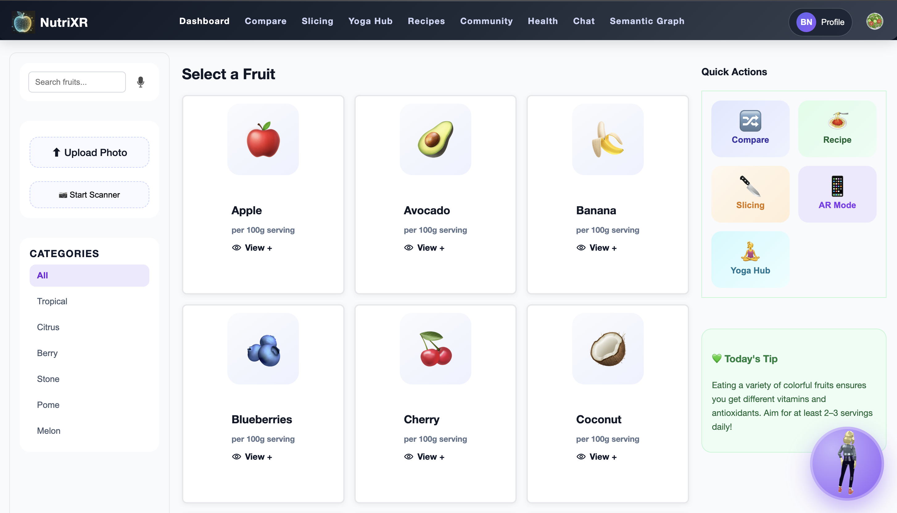
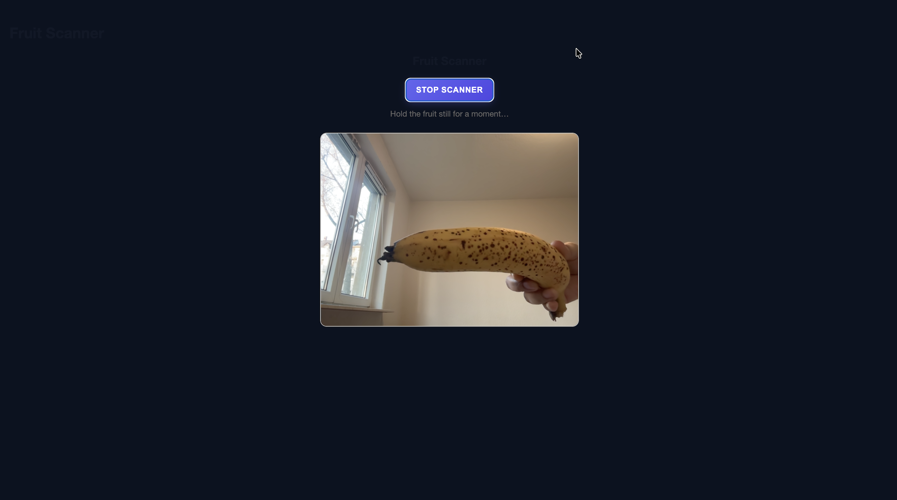

# NutriXR

## Product Vision

NutriXR is an AI-powered wellness and nutrition platform designed to make healthy living more interactive, personalized, and engaging through intelligent food analysis, immersive AR experiences, and guided wellness support.

The platform combines AI-assisted nutrition guidance, fruit recognition, augmented reality visualization, recipe recommendations, and wellness experiences into a unified digital product focused on improving user engagement and accessibility in health and nutrition.

---

## Problem

Traditional nutrition and wellness applications often provide static information with limited personalization and low user engagement.

Users frequently struggle to:
- Understand nutritional information visually
- Compare healthy food choices interactively
- Access personalized wellness recommendations
- Stay engaged with conventional health applications

NutriXR addresses these challenges by integrating AI-powered assistance, immersive visualization, and interactive wellness experiences into a single platform.

---

## Key Features

- AI-powered dietitian chat assistant with optional LLM integration
- Fruit recognition and nutrition analysis
- Interactive AR-based food visualization using WebXR
- Personalized recipe recommendations
- Nutrition dashboards and nutrient insights
- Yoga and wellness guidance hub
- User authentication and profile management
- Responsive user experience across devices

---

## Technology Stack

### Frontend
- React
- Vite
- JavaScript
- CSS

### Backend
- Node.js
- Express.js

### AI & AR
- Groq / OpenAI / Ollama (optional)
- TensorFlow
- Teachable Machine
- A-Frame
- WebXR

### State Management
- React Context API

---

## System Architecture

NutriXR follows a modular full-stack architecture consisting of:
- Frontend user interface layer
- Backend API and chat server
- AI-assisted nutrition workflows
- AR visualization components
- Nutrition and wellness data modules

The system is designed to support scalable wellness interactions while enabling modular AI integrations and immersive user experiences.

---

## AI Configuration

The application supports optional LLM integration using:
- Groq
- OpenAI
- Ollama

For portfolio and demo purposes, the platform can also run entirely in local demo mode without external API configuration.

---

## Setup Instructions

### Prerequisites

- Node.js 18+
- npm

---

### Install Dependencies

```bash
npm install --legacy-peer-deps
```

---

### Environment Variables

Create a `.env` file in the project root:

```env
DIETITIAN_DEMO_MODE=true
```

---

### Run Backend Server

```bash
npm run server
```

---

### Run Frontend

```bash
npm run dev
```

---

### Open Application

```bash
http://localhost:5173
```

---

## Screenshots

### Dashboard Experience


### AR Food Visualization


### AI Dietitian Assistant


### Fruit Recognition Workflow


---

## Project Contribution

Contributed to product design, AI-assisted nutrition workflows, system architecture, interactive user experience design, and wellness feature integration as part of a university team project at TU Chemnitz.

Key contribution areas included:
- Product and feature ideation
- AI-assisted wellness interaction concepts
- User workflow and system interaction design
- Dashboard and experience integration
- Architecture and functionality planning

---

## Achievement

Top 3 finalist project in university evaluation.

---

## Repository Structure

```plaintext
NutriXR/
├── public/
├── scripts/
├── server/
├── src/
├── README.md
├── package.json
├── vite.config.js
└── .gitignore
```

---

## Security Notes

- API keys and sensitive credentials are not included in this repository.
- `.env` files are excluded from version control.
- Demo mode is enabled for safe local execution.

---

## Future Improvements

- Advanced AI nutrition recommendation engine
- User behavior analytics and personalization
- Expanded AR wellness experiences
- Wearable and fitness tracker integration
- Multi-language wellness support

---

## Author

**Bhavana Rasamsetti**  
Web Engineering – TU Chemnitz

---